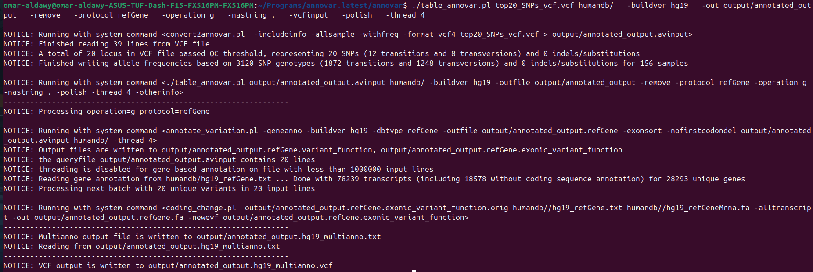

```{r setup, include=FALSE}
knitr::opts_chunk$set(echo = TRUE)
```

```{r, message=FALSE, warning=FALSE}
# Install required packages if not already installed
if (!require("BiocManager", quietly = TRUE))
    install.packages("BiocManager")

BiocManager::install(c("SNPRelate", "GENESIS", "qqman", "GeneNet", "xlsx", "GWASTools", "SeqVarTools", "SeqArray", "RCy3"))

if(!require("SNPRelate", quietly = TRUE))
    install.packages("SNPRelate")

if(!require("GENESIS", quietly = TRUE))
    install.packages("GENESIS")

if(!require("dplyr", quietly = TRUE))
    install.packages("dplyr")

if(!require("openxlsx", quietly = TRUE))
    install.packages("openxlsx")

if(!require("readxl", quietly = TRUE))
    install.packages("readxl")

if(!require("ggplot2", quietly = TRUE))
    install.packages("ggplot2")

if(!require("qqman", quietly = TRUE))
    install.packages("qqman")
```

# Task 1 : Compute Kinship using SNPRelate and GENESIS

```{r, message=FALSE, warning=FALSE}
# Load required libraries
library(SNPRelate)
library(GENESIS)
library(GWASTools)
library(SeqVarTools)
library(SeqArray)
library(dplyr)
library(openxlsx)
library(readxl)
library(ggplot2)
library(qqman)
```

```{r, eval=FALSE}
# Convert PLINK format to GDS format
snpgdsPED2GDS("Dataset/input.ped", "Dataset/input.map", "Dataset/genotype.gds")

# Open the GDS file
genofile <- snpgdsOpen("Dataset/genotype.gds")

# Calculate kinship using MLE method
ibd <- snpgdsIBDMLE(genofile, 
                        num.thread = 6,  
                        kinship.constraint = TRUE,
                        kinship = TRUE)  

kinship <- ibd$kinship
rownames(kinship) <- colnames(kinship) <- ibd$sample.id

# Close the GDS file
snpgdsClose(genofile)

# Count individuals with kinship > 0.1
high_kinship <- (sum(kinship > 0.1, na.rm = TRUE) - 156) / 2.0  
cat("Number of individuals with kinship > 0.1:", high_kinship, "\n")
```

-   Save kinship matrix

```{r, eval=FALSE}
write.xlsx(kinship, file = "Dataset/Kinship_Matrix.xlsx", rowNames = TRUE)
```

-   Load kinship matrix

```{r}
kinship <- as.matrix(read.xlsx("Dataset/Kinship_Matrix.xlsx", rowNames = TRUE))
```

# Task 2: Compute mQTLs with Mixed Models

```{r}
# Load PCA data
pca_data <- read.table("Dataset/Dataset of 156 Qataris/pca_results.eigenvec", header = FALSE)
colnames(pca_data) <- c("FID", "IID", paste0("PC", 1:20))
rownames(pca_data) <- pca_data$IID
pcs <- pca_data[, c("PC1", "PC2", "PC3")]

# Load metabolite data
metabolites <- read.csv("Dataset/qatari_metabolites_2025.csv", row.names = 1)

# Merge PCA with metabolite data
all.data <- as.data.frame(cbind(pcs, metabolites))
meta.names <- colnames(metabolites)

# Sample IDs
scan_annot_df <- data.frame(
  scanID = rownames(metabolites),
  stringsAsFactors = FALSE
)
rownames(scan_annot_df) <- scan_annot_df$scanID
scan_annot <- ScanAnnotationDataFrame(scan_annot_df)
```

```{r}
genoFile <- "Dataset/genotype.gds"
gds <- GdsGenotypeReader(genoFile)
genoData <- GenotypeData(gds, scanAnnot = scan_annot)
alleleB <- getAlleleB(genoData)
```

```{r}
results <- list()
null_models <- list()

for (meta in meta.names) {
  df <- all.data[, c("PC1", "PC2", "PC3", meta)]
  colnames(df)[4] <- "trait"
  
  null.model <- fitNullModel(
    x = df,
    outcome = "trait",
    covars = c("PC1", "PC2", "PC3"),
    cov.mat = kinship,
    family = "gaussian",
    verbose = TRUE
  )
  
  genoIterator <- GenotypeBlockIterator(genoData)
  assoc <- assocTestSingle(
    gdsobj = genoIterator,
    null.model = null.model,
    verbose = TRUE
  )
  
  assoc$effect_allele <- alleleB[assoc$variant.id]
  null_models[[meta]] <- null.model
  assoc$metabolite <- meta
  results[[meta]] <- assoc
}

head(results$Metabolite5)

dim(results$Metabolite5)
```

```{r}
close(gds)
```

```{r}
all_results <- bind_rows(results)
all_results$degree_of_freedom <- all_results$n.obs - 4
significant_results <- filter(all_results, Score.pval < 0.0001)
dim(significant_results)
```

```{r}
write.xlsx(significant_results, file = "Dataset/Significant_results.xlsx", rowNames = FALSE)
write.xlsx(all_results, file = "Dataset/All_results.xlsx", rowNames = FALSE)
```

```{r}
heritability_results <- lapply(names(null_models), function(met) {
  model <- null_models[[met]]
  h2_ci <- varCompCI(model, prop = TRUE)
  print(h2_ci)
})

herit_df <- do.call(rbind, heritability_results)
```

# Task 3: Inflation factor calculation


```{r}
# Function to compute lambda_GC from a vector of p‑values
calc_lambda <- function(p) {
  # drop invalid p's
  p <- p[!is.na(p) & p > 0 & p < 1]
  # convert to chi^2 (df=1) and take the median
  chisq_med <- median(qchisq(p, df = 1, lower.tail = FALSE))
  # theoretical median of X^2 is qchisq(0.5,1)
  lambda_gc  <- chisq_med / qchisq(0.5, 1)
  return(lambda_gc)
}

# Loop over your 'results' list
inflation_results <- lapply(names(results), function(met) {
  df <- results[[met]]
  lambda <- tryCatch(calc_lambda(df$Score.pval),
                     error = function(e) NA_real_)
  data.frame(
    metabolite = met,
    lambda_gc  = lambda,
    stringsAsFactors = FALSE
  )
})

inflation_df <- do.call(rbind, inflation_results)

# Compute the average lambda_GC across all metabolites
avg_lambda <- mean(inflation_df$lambda_gc, na.rm = TRUE)

# Add the average as a final summary row:
inflation_df <- rbind(
  inflation_df,
  data.frame(metabolite = "AVERAGE", lambda_gc = avg_lambda, stringsAsFactors = FALSE)
)

# Inspect
print(inflation_df)
```

# Task 4: Create Manhattan Plots

```{r}
# 1. Load the results
df <- all_results

# 2. Rename & clean columns
df$SNP        <- df$variant.id
df$BP         <- as.numeric(df$pos)
df$P          <- as.numeric(df$Score.pval)
df$Metabolite <- as.factor(df$metabolite)
df$chr[df$chr == "X"] <- "23"
df$CHR <- as.numeric(df$chr)

# 3. Output directory
out_dir <- "plots"
if (!dir.exists(out_dir)) dir.create(out_dir)

# 4. Thresholds
threshold_gw   <- 1e-4
threshold_sugg <- 1e-5

# 5. Per-metabolite ggplot2 Manhattan plots
mets <- levels(df$Metabolite)

for (met in mets) {
  subdf <- subset(df, Metabolite == met)
  subdf <- subdf[complete.cases(subdf[, c("CHR","BP","P")]), ]
  subdf <- subset(subdf, CHR %in% 1:23 & P > 0 & P <= 1)
  
  if (nrow(subdf) < 10) {
    warning(sprintf("Skipping %s: only %d valid SNPs", met, nrow(subdf)))
    next
  }
  
  # Add -log10(P)
  subdf$negLogP <- -log10(subdf$P)
  
  #png(
 #   filename = file.path(out_dir, paste0("Manhattan_", met, ".png")),
  #  width    = 12,
  #  height   = 6,
  #  units    = "in",
  #  res      = 300
 # )
  
  p <- manhattan(subdf,
            main = paste("Manhattan Plot —", met),
            col = c("skyblue", "orange"),
            suggestiveline = FALSE,
            genomewideline = -log10(1e-4))
  
  #dev.off()
}
```

```{r}
df_unique <- df

df_unique$P <- -log10(df_unique$P)

# Save plot
#png("plots/Manhattan_plot_all_metabolites.png", width = 12, height = 6,units = "in", res = 300)

p_all <- manhattan(df_unique,
            main = "Combined Manhattan Plot (All Metabolites)",
            col = c("skyblue", "orange"),
            suggestiveline = FALSE,
            genomewideline = -log10(1e-4))

#dev.off()
```

# Task 5: Metabolite Network

```{r, eval=FALSE}
library(dplyr)
library(GeneNet)
library(RCy3)

# Create a matrix to hold the corrected values
corrected_matrix <- matrix(NA, nrow = nrow(metabolites), ncol = length(meta.names))
rownames(corrected_matrix) <- rownames(metabolites)
colnames(corrected_matrix) <- meta.names

# Fill matrix with residuals from each null model
for (met in meta.names) {
 model <- null_models[[met]]
 if (!is.null(model)) {
  fittedData <- model$fit$fitted.values
  corrected_matrix[, met] <- fittedData
 }
}

# Estimate partial correlations
pcor <- ggm.estimate.pcor(corrected_matrix)

# Test for significant associations
network_results <- network.test.edges(pcor)

# Filter significant pairs (pval < 0.05)
sig_pairs <- network_results %>% 
 filter(pval < 0.05) %>%
 arrange(desc(abs(pcor)))

# Save results
write.csv(sig_pairs, "Dataset/significant_pairs.csv", row.names = FALSE)

cytoscapePing()

# Prepare edges and nodes
edges <- data.frame(
 source = as.character(sig_pairs$node1),
 target = as.character(sig_pairs$node2),
 weight = sig_pairs$pcor,
 interaction = "interacts_with",
 pval = sig_pairs$pval,
 qval = sig_pairs$qval,
 stringsAsFactors = FALSE
)

nodes <- data.frame(
 id = unique(c(edges$source, edges$target)),
 name = unique(c(edges$source, edges$target)),
 stringsAsFactors = FALSE
)

# Create network in Cytoscape
createNetworkFromDataFrames(
 nodes = nodes,
 edges = edges,
 title = "Metabolic Network",
 collection = "Metabolite Correlations"
)

# Apply layout and visual styles
layoutNetwork("force-directed")

setNodeShapeDefault("ELLIPSE")
setNodeSizeDefault(30)
setNodeLabelMapping("name")

setEdgeLineWidthMapping(
 table.column = "weight",
 table.column.values = seq(min(abs(edges$weight)), max(abs(edges$weight)), length.out = 5),
 widths = seq(1, 3, length.out = 5),
 mapping.type = "continuous"
)

setEdgeColorMapping(
 table.column = "weight",
 table.column.values = c(min(edges$weight), 0, max(edges$weight)),
 colors = c("red", "blue", "yellow"),
 mapping.type = "continuous"
)


analyzeNetwork()
node.table <- getTableColumns(table = "node")
write.csv(node.table, "metabolite_network_node_metrics.csv", row.names = FALSE)
saveSession("Metabolite_Network_Analysis.cys")
print(head(node.table[, c("name", "Degree", "ClosenessCentrality", "BetweennessCentrality")]))

```


# Task 6: Annotate Significant SNPs

## Read the map file and extract the top 20 SNPs

```{r}
map_data <- read.table("Dataset/input.map", header = FALSE, stringsAsFactors = FALSE)

# Assign column names
colnames(map_data) <- c("chr", "snp_id", "pos_cM", "pos")
map_data <- subset(map_data, select= -c(pos_cM))
```

```{r}
# Read the Excel file
df <- read_excel("Dataset/Significant_results.xlsx", sheet = 1)

# Select top 20 unique SNPs based on lowest p-value
top_snps <- df[order(df$`Score.pval`), ]
top_snps <- top_snps[!duplicated(top_snps$`variant.id`), ]
top_snps <- subset(top_snps, select = c("chr", "pos"))
top_snps <- head(top_snps, 20)
top_snps$chr[top_snps$chr == "X"] <- 23
top_snps$chr <- as.integer(top_snps$chr)

top_20snps <- inner_join(top_snps, map_data, by = c("chr", "pos"))
# Save to a plain text file
writeLines(top_20snps$snp_id, "Dataset/snps_list.txt")
```

## Extract the top 20 SNPs from .ped and .map files into new files using Plink.

```{bash, eval=FALSE}
plink --file input --extract snps_list.txt --make-bed --out top20_SNPs
```


## Convert the top 20 SNPs to VCF format using PLINK.


```{bash, eval=FALSE}
plink --bfile top20_SNPs --recode vcf --out top20_SNPs_vcf
```

## Download ANNOVAR and make sure you have Perl on your machine and you download the refGene annotation database for the human genome version hg19

```{bash, eval=FALSE}
sudo apt update
sudo apt install perl
perl -v
```


```{bash, eval=FALSE}
./annotate_variation.pl -buildver hg19 -downdb -webfrom annovar refGene humandb/
```

## Annotate the top 20 SNPs using ANNOVAR

-   top20_SNPs_vcf.vcf: Input VCF file containing SNPs to annotate.

-   humandb/: Directory containing ANNOVAR's annotation databases (e.g., refGene).

-   buildver hg19: Specifies the human genome version (hg19).

-   out output/annotated_output: Output prefix and directory for results.

-   remove: Delete intermediate files after annotation.

-   protocol refGene: Use the refGene database for annotation (gene-based).

-   operation g: The operation type is gene-based (g).

-   nastring .: Missing values in the output will be represented as ..

-   vcfinput: Indicates the input file is in VCF format.

-   polish: Refines annotations (e.g., handles multi-allelic variants better).

-   thread 4: Use 4 threads to speed up processing.



```{bash, eval=FALSE}
./table_annovar.pl top20_SNPs_vcf.vcf humandb/   -buildver hg19   -out output/annotated_output   -remove   -protocol refGene   -operation g   -nastring .   -vcfinput   -polish   -thread 4
```

```{r}
data <- read.table("Annovar/annotated_output.hg19_multianno.txt", header = TRUE, sep = "", stringsAsFactors = FALSE)
print(data)
```

# Task 7: Regional plots using SNIPA

## Get the top 5 most significant unique associated SNPs

```{r}
df <- read_excel("Dataset/Significant_results.xlsx", sheet = 1)

top_snps <- df[order(df$`Score.pval`), ]
top_snps <- top_snps[!duplicated(top_snps$`variant.id`), ]
top_snps <- subset(top_snps, select = c("chr", "pos"))
top_snps <- head(top_snps, 5)
top_snps$chr[top_snps$chr == "X"] <- 23
top_snps$chr <- as.integer(top_snps$chr)

top_5snps <- inner_join(top_snps, map_data, by = c("chr", "pos"))
# Save to a plain text file
writeLines(top_5snps$snp_id, "Dataset/top5_SNPs.txt")
```

## The proxy SNPs in LD with the top 5 most significant unique associated SNPs.


## Some proxy SNPs annotations for each significant SNP


## The regional plots for the closest 5 SNPs in the proxy.


